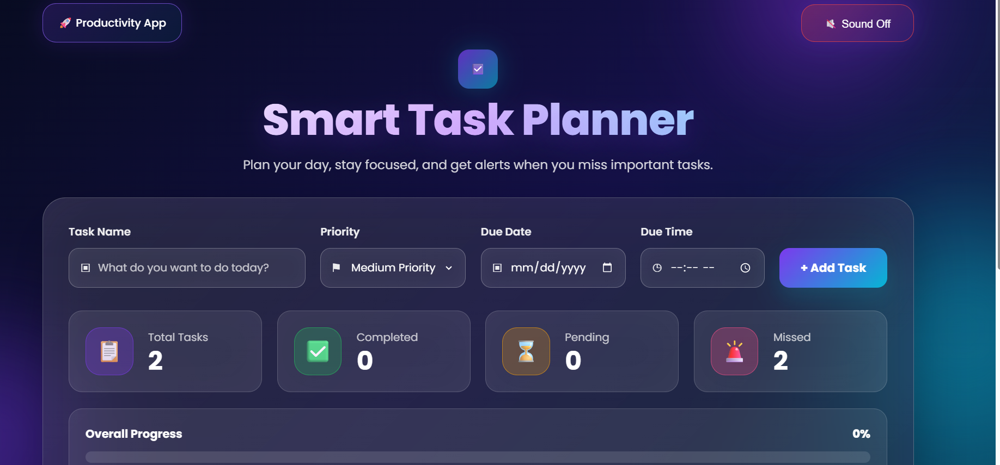

# Smart Task Planner

Smart Task Planner is a modern and responsive task management web app built with HTML, CSS, and JavaScript.

It helps users organize tasks, set priorities, add due dates and due times, track progress, and receive alerts when tasks are missed.

## Features

- Add new tasks
- Set task priority: Low, Medium, High
- Add due date
- Add due time
- Mark tasks as completed
- Edit task names
- Delete tasks
- Search tasks
- Filter tasks by:
  - All
  - Pending
  - Completed
  - Missed
- Missed task alerts
- Browser notification support
- Progress tracking with progress bar
- Task statistics dashboard
- Saves tasks using browser localStorage
- Modern glassmorphism UI
- Responsive design for desktop and mobile

## Tech Stack

- HTML
- CSS
- JavaScript

## How to Run

1. Download or clone this repository.
2. Open the project folder.
3. Open `index.html` in your browser.
4. Start adding your tasks.

## Folder Structure

```text
smart-task-planner/
├── index.html
├── style.css
├── script.js
└── README.md
```

## Live Demo

https://e22001.github.io/smart-task-planner/

## Screenshot




